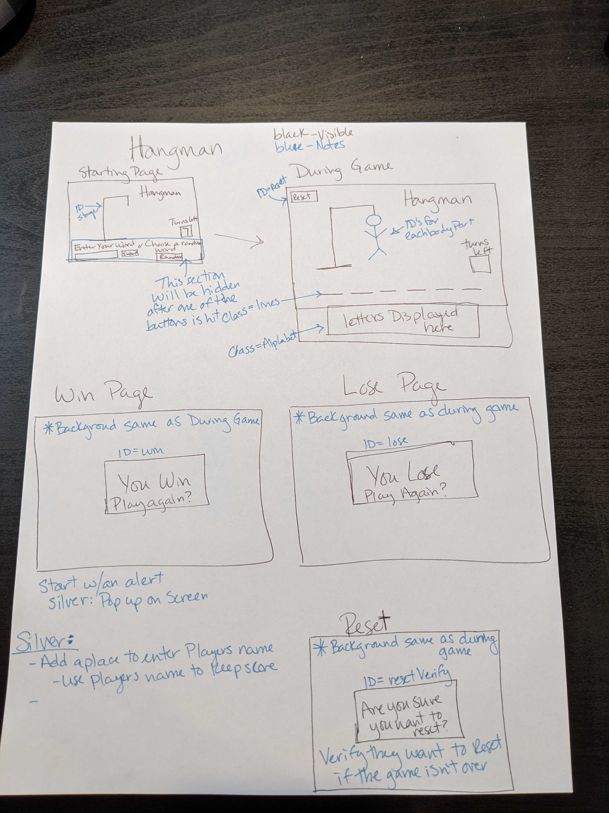

# SEI - Project 1

# Project Overview

## Project Schedule

| Day | Deliverable                                          | Status   |
| --- | ---------------------------------------------------- | -------- |
| 1   | Project Description                                  | Complete |
| 2   | Wireframes / Priority Matrix / Functional Components | Complete |
| 3   | Core Application Structure (HTML, CSS, JavaScript)   | Complete |
| 4   | Minimal Viable Product                               | Complete |
| 5   | Styling / Bug Fixes                                  | Complete |
| 6   | Presentations Preparations                           | Complete |

## Project Description

For this first project, I have decided to create the game of hangman using my skills learned so far in class. I plan to set up an array of ransom words the user can use if they are playing alone and also an input box so they can input their own word. They will have 7 chances to get the word correct. There will be a keyboard so they can choose letters. After a letter has been chosen, it will go dark so they can't pick it anymore. If they pick the correct letter, that letter will show up in the word for all instances of that letter. As each wrong letter is chosen, I body part will appear for the hangman. Once the player is out of turns, they will see a game over screen and have to try again. If they win, they will see a game over screen celebrating the win.

## Wireframes



## Priority Matrix

### MVP/PostMVP

#### MVP

- Have an array of words for the hangman game.
- Have all event listeners working for each letter.
- Have body parts appear each wrong guess.
- Have win logic completed when the guesses match the winning word.
- Have lose modal appear when chances run out.
- Disable buttons once used.
- Display the correct letters on the lines provided.
- Display the moves you have left to make.
- Visual:
-- Hangman stage with noose
-- Basic shapes for the hangman
-- Plain lines for the word to be guessed
-- Random Button
-- Reset Button

#### Post MVP

- Have my site respond to mobile use.
- Add input box for the user to chose their own word.
- Create a score count.  
-- Attribute score to how many turns were taken.
- Add a timer.
- Animate the pop-up box for win/lose versus an alert.
- Visual:
-- Choose a theme for the game
-- Update the background and the shapes for the hangman
-- Fade out the a box and turn it into a letter when the player gets it right.
-- Use an API for the random words.

## Functional Components

### Game Initialization

Upon loading the page you can select the button to choose a random word from an array.

### Playing the Game

Once a random word have been selected, you will have a keyboard to use for selecting what letters you think are in the hidden word.

### Winning the Game

If you can guess the word correctly, you win the game! If not, your man will be hung!

### Game Reset

If you want to restart the game you can simply hit the restart button at the top at anytime.

### Time Commitment:

| Component           | Priority | Estimated Time | Time Invested | Actual Time |
| ------------------- | :------: | :------------: | :-----------: | :---------: |
| Creating HTML       |    H     |      3hrs      |     2hrs      |    2hrs     |
| Creating CSS        |    H     |      2hrs      |    1.5hrs     |   1.5hrs    |
| Creating Javascript |    H     |     30hrs      |     20hrs     |    20hrs    |
| CSS Clean-up        |    H     |      1hrs      |    1.5hrs     |   1.5hrs    |
| Error Resolution    |    H     |      1hrs      |    1.5hrs     |   1.5hrs    |
| Total               |    H     |     43hrs      |    26.5hrs    |   26.5hrs   |

## Additional Libraries

## Code Snippet

For me, I learned how to create Modal's with this project.  Here is my first modal in code:
```
winModal.style.visibility = "visible"
                    winModal.querySelector(".close")
                    .addEventListener('click', (e) => winModal.style.visibility = "hidden")
```

## Change Log

## Issues and Resolutions
